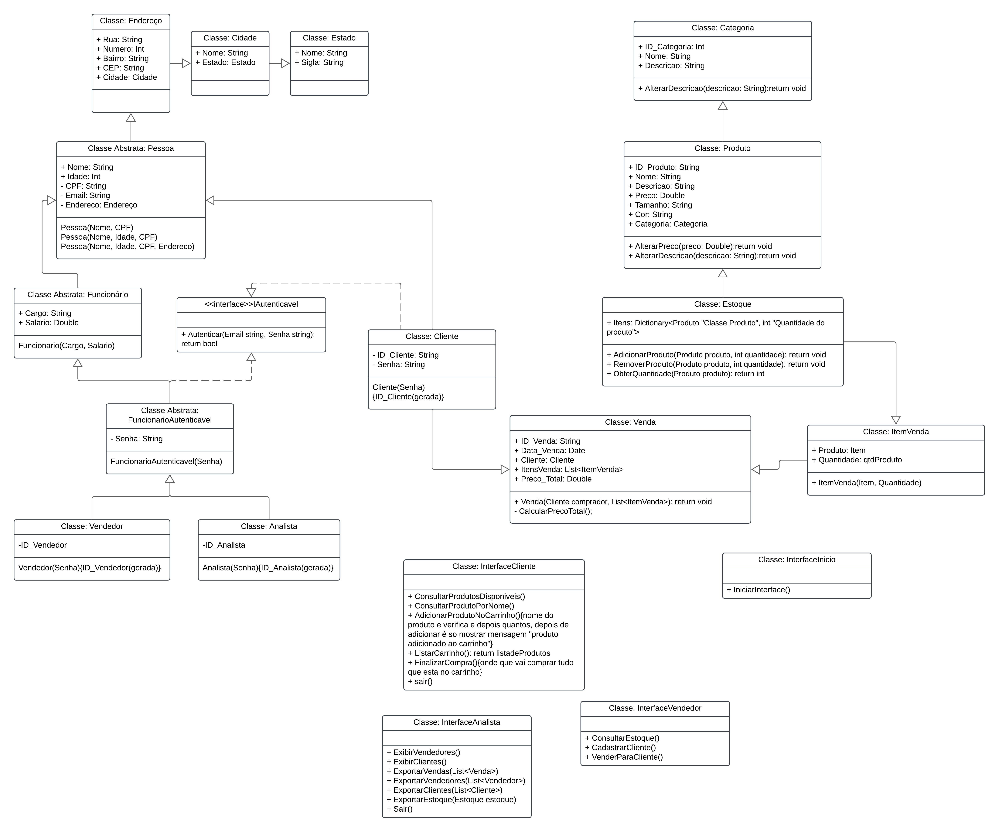

# Lolja - Sistema de Gerenciamento de Roupas

**Lolja** é um sistema desenvolvido em C# que auxilia no gerenciamento de um projeto de roupas. A aplicação permite organizar produtos, controlar estoques e gerenciar pedidos, oferecendo uma interface intuitiva e funcionalidades modernas para o setor de moda.

---

## 📋 Funcionalidades

- **Gestão de Estoques**: Monitore a quantidade de itens disponíveis, com alertas para reposição.
- **Gerenciamento de Clientes**: Criação de perfis de clientes com informações pessoais e histórico de compras.
- **Relatórios Avançados**: Geração de relatórios personalizados para vendas, clientes e estoque.
- **Interface Intuitiva**: Design amigável e responsivo para fácil uso.
- **Gestão de Vendas**: Monitorando e gerando histórico de vendas por usuário.

---

## 🗂️ Diagrama de Classes

O sistema Lolja segue uma estrutura orientada a objetos, conforme mostrado no diagrama de classes abaixo:



> O diagrama representa a estrutura principal do sistema, incluindo as relações entre as classes `Pessoa`, `Produto`, `Cliente`, `Venda`, `Estoque`, e interfaces para diferentes papéis (cliente, vendedor e analista).

---

## 🛠️ Tecnologias Utilizadas

- **Linguagem**: C#
- **Ferramenta**: Visual Studio
- **Json.NET**: Newtonsoft


---

## 🚀 Como Executar o Projeto

### Passos:
1. Clone o repositório:
   ```bash
   git clone https://github.com/maiconVegas/loja-Vendas-Roupas-NET-CSharp.git
